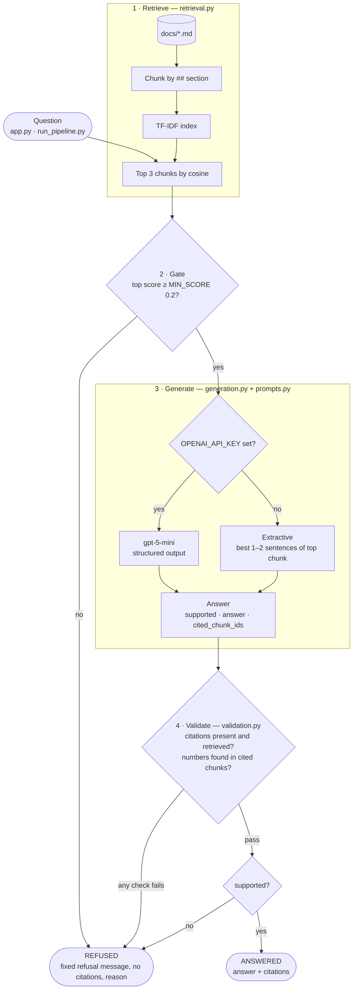

# Grounded support-docs QA

A small retrieval-augmented QA service over the local `docs/` folder. It retrieves passages with hybrid TF-IDF + BM25 retrieval, answers with citations, refuses questions the docs don't support, and checks every answer deterministically before returning it.

## Run it

```bash
pip install -r requirements.txt
cp .env.example .env            # optional: add OPENAI_API_KEY; without it the extractive fallback runs
python run_pipeline.py          # answers questions.json and writes the 3 artifacts to outputs/
python app.py --question "How long do crypto withdrawals take?"
pytest -q                       # offline, never calls the LLM
```

Python 3.13. There are no services, databases or model downloads.

| Output | Contents |
|--------|----------|
| `outputs/retrieval_results.json` | Top-3 chunks per question: `doc_id`, `chunk_id`, `score`, `text` |
| `outputs/answers.json` | `answer`, `citations` (doc ids), `cited_chunk_ids`, `supported`, `generator`, `reason` |
| `outputs/validation_report.json` | Per question: checks passed, failures, behaviour match, retrieval and citation hit; plus a summary |
| `logs/pipeline.jsonl` | One JSON line per stage event: `docs_loaded`, `chunks_created`, `index_built`, `retrieval`, `gate_refused`, `generation` (tokens, latency), `validation` |

## Architecture



Every question ends in exactly one of two states. A refusal always records why:

| `reason` | Set by |
|----------|--------|
| `low_retrieval_confidence` | Gate: no chunk scored at least `MIN_SCORE` (the generator is never called) |
| `model_unsupported` | Generator: the context doesn't fully answer the question |
| `generation_error:<Error>`, `unparsed_output` | Generator: API error or timeout after 2 retries, or output that doesn't fit the schema |
| `validation_failed` | Validator: any check failed, so the draft answer is thrown away |

The hand-drawn version is in [design/architecture.png](design/architecture.png).

Each stage is its own module, with explicit inputs and outputs:

| File | Role |
|------|------|
| `retrieval.py` | `load_documents` → `chunk_document` → `build_index` (TF-IDF + BM25) → `retrieve(index, question) -> list[RetrievedChunk]` |
| `prompts.py` | The only place prompt text lives: `SYSTEM_PROMPT`, `REFUSAL_MESSAGE`, `build_user_prompt()` |
| `generation.py` | `generate(question, retrieved) -> Answer`. Uses `gpt-5-mini` if a key is set, otherwise extractive |
| `validation.py` | `validate(answer, retrieved) -> list[str]`, a pure function with no I/O |
| `run_pipeline.py` | `answer_question()` is the orchestrator (retrieve → gate → generate → validate). `main()` runs the eval |
| `app.py` | CLI wrapper around `answer_question()` |
| `tests/test_pipeline.py` | Chunking, retrieval (incl. the BM25 side), validator rules, gate, fail-closed, input validation |

Design choices and the reasons for them are in [DECISIONS.md](DECISIONS.md).

## How retrieval works

Each markdown `##` section becomes one chunk. A chunk's text starts with `Title > Heading`, so the heading's words count toward the match. Sections over 800 characters are split on paragraph boundaries. Chunk ids are `<file stem>_<n>`. Each chunk is indexed two ways:

- **TF-IDF**: scikit-learn `TfidfVectorizer` (1–2-grams, English stop words, sublinear tf), scored by cosine similarity.
- **BM25**: word tokens with English stop words removed and a trailing plural `s` stripped ("fees" → "fee"), scored with textbook BM25 (`k1=1.5`, `b=0.75`). It's written by hand on top of `CountVectorizer`, so there's no new dependency.

The two rankings are merged with reciprocal-rank fusion (`1/(60 + rank)` summed over both, ties broken by cosine), and the top 3 are returned. Each returned chunk's `score` is still its TF-IDF cosine, so the gate threshold below keeps its meaning. The index is rebuilt on every run.

### Practical improvement: hybrid retrieval

**Why this one.** The confidence gate was already in place (D8), and the error analysis below showed the next weakness was retrieval. TF-IDF matches exact strings only, so "fee" doesn't match "fees" and the right chunk gets outranked. BM25 over lightly stemmed tokens catches those word forms. It's also the cheapest fix available: no model download, no new dependency, and about 30 lines of code.

**Why rank fusion, not score blending.** BM25 scores are unbounded and TF-IDF cosines sit in [0, 1]. Adding the two would need a weight tuned on this 9-question set. Fusing ranks needs no calibration, and the constant (60) is the standard default, not tuned here. The gate keeps using the TF-IDF cosine for the same reason: `MIN_SCORE` was set on that scale, and a gate on BM25 would need re-tuning. A chunk that only BM25 matches can be retrieved but still scores 0 on the gate.

**Effect.** Nothing moved on the eval set. Hit@3, citation hit and behaviour accuracy are identical, and every question's gate score is unchanged, so q6–q8 are still refused by the gate. On the known misses:

| Question (asked by hand) | TF-IDF top 3 | Hybrid top 3 |
|---|---|---|
| What is the fee for a bank transfer withdrawal? | same-method, processing, **fees** | same-method, **fees**, processing |
| How long do crypto withdrawals take? | fees, processing, *password rules* | fees, processing, limits |

BM25 on its own ranks the Fees chunk first for the fee question (9.1 vs 4.9). With only two rankers, though, the fused ranks tie exactly, and the tie goes to TF-IDF. The gain is modest: better recall inside the top 3, with the top-1 unchanged. That helps the LLM, which reads all 3 chunks, more than the extractive baseline, which reads only the first.

## Grounding and refusal: three layers

1. **Gate (stretch item).** If no chunk scores at least `MIN_SCORE = 0.2`, the pipeline refuses before any LLM call (`reason: low_retrieval_confidence`). This is cheap and deterministic, and it gives the no-key fallback a way to refuse.
2. **Prompt and schema.** The model sees only the numbered chunks. It must return a `GroundedAnswer {supported, answer, cited_chunk_ids}` through OpenAI structured output (`responses.parse`). The prompt says to set `supported=false` whenever the context doesn't *fully* answer the question, including partially answerable ones. Timeouts, API errors (after 2 retries), model refusals and unparseable output all become a refusal with a `reason`.
3. **Validator, fail closed.** `validate()` checks for these failures: an empty answer; a supported answer without a citation; a cited chunk that wasn't retrieved; a citation to a doc that wasn't retrieved; a number in the answer that isn't in the cited chunks; a refusal that isn't the exact refusal message or that carries citations. If any check fails, the answer is replaced by the refusal (`reason: validation_failed`).

Every refusal has the same shape: `supported: false`, empty citations, the fixed `REFUSAL_MESSAGE`, and a `reason`.

## Results

Eval set (`questions.json`): 5 answerable questions and 4 unanswerable ones. The unanswerable four are off-topic (q6), plausible but absent (q7, forex leverage), and two partially answerable ones. q8 asks for Level 2 *and* Level 3 limits, which falls below the gate. q9 asks for Level 2 *and corporate* limits, which clears the gate (top score 0.27), so the model itself has to refuse it.

| Metric | Extractive baseline | gpt-5-mini |
|--------|--------------------:|-----------:|
| Validator checks passed | 9/9 | 9/9 |
| Behaviour accuracy (answered vs refused as expected) | 8/9 | **9/9** |
| Retrieval hit@3 (answerable) | 5/5 | 5/5 |
| Citation hit (cites an expected doc) | 5/5 | 5/5 |
| Answer fully covers the question (manual read) | 4/5 | 5/5 |
| Tokens (6 generated answers) | 0 | 2,681 in / 1,547 out |
| Latency per generated answer | <1 ms | 3.0–5.2 s (gpt-5-mini runs vary) |

The committed artifacts are from the `gpt-5-mini` run. To reproduce the baseline, run with an empty `OPENAI_API_KEY`.

### Error analysis

- **The baseline answers the wrong part of multi-part questions.** For q3 (REST limit *and* the status code), the extractive generator only reads the top chunk. It returns the 120 requests/minute limit plus an unrelated WebSocket sentence and misses "HTTP 429", which is in the second-ranked chunk. The behaviour metric still counts this as correct, which is why I also report the manual coverage row. `gpt-5-mini` combines both chunks and cites both.
- **Word forms.** For "What is the fee for a bank transfer withdrawal?" (asked by hand), TF-IDF ranks the *same-method rule* chunk above the *Fees* chunk, because "fee" ≠ "fees". Hybrid retrieval lifts Fees from 3rd to 2nd but ties it for 1st (see above), so the top-1 is unchanged. The baseline then answers "Any profit above that amount is paid by bank transfer", which is wrong. The LLM answers "a flat 5 USD" correctly because the Fees chunk is still in the top 3.
- **The baseline can't detect partial support (q9).** q9 clears the gate, and the extractive generator returns the Level 2 limits as if they answered the whole question. `gpt-5-mini` refuses it (`reason: model_unsupported`), which is the only behaviour difference between the two runs. q6–q8 score below 0.2 (0.0, 0.165, 0.163) and are stopped by the gate in both runs, so q8 is refused for its low score, not because partial support was detected. By hand, "can agents unlock early, *and what is the phone number*" (0.31) is also refused by the model. With a bad API key, the pipeline fails closed with `generation_error:AuthenticationError`.
- **Another retrieval miss (by hand).** "How long do crypto withdrawals take?" ranks the Fees chunk first ("take" vs "processing times"), so the baseline answers with the network-fee sentence. Neither retriever can fix this: it's a paraphrase, not a word form. Hybrid retrieval does replace the off-topic *password rules* chunk in the top 3 with *withdrawal limits*.

## Limitations

- Retrieval is still lexical. BM25's plural-only stemmer catches "fee"/"fees" but not "processing"/"processed", and neither retriever handles synonyms or paraphrases ("2FA" vs "two-factor", "take" vs "processing times").
- With two rankers, reciprocal-rank fusion often ties (rank 1 + rank 3 = rank 3 + rank 1). Ties go to TF-IDF.
- `MIN_SCORE` was tuned on the same eval questions it is evaluated on, with no held-out set. The gap it sits in (0.165 vs 0.272) is narrow, so a legitimate but tersely worded question could be refused.
- The extractive baseline can't detect partial support. Whatever overlaps with the question gets returned.
- The validator proves each cited chunk was retrieved and that the answer's numbers appear in it. It does not prove the claim is *entailed* by the chunk.
- 9 questions is too few for confident metrics; the figures show behaviour, not statistical performance.
- The index is rebuilt on every run, which is fine for 5 docs.

## Next steps

- A larger labelled eval set with a held-out split for tuning `MIN_SCORE`, including more partial and adversarial questions that pass the gate.
- Dense retrieval (a small embedding model) as a third ranker in the fusion, to cover synonyms and paraphrases. Measure it against the current hybrid on a larger labelled set that includes paraphrased questions.
- An entailment check (NLI model or LLM judge) in the validator, reported next to the deterministic checks.
- Cache the index to disk when the corpus grows.
